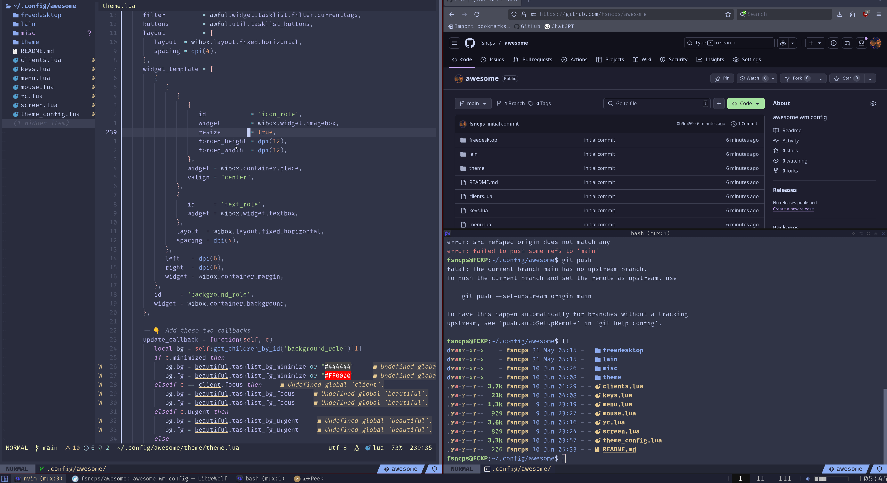

## Awesome WM conf

Simple awesome wm setup for my 3 screens. Has theme elements from [awesome-copycats](https://github.com/lcpz/awesome-copycats) and [catppuccin](https://catppuccin.com/palette/) colours.

---

